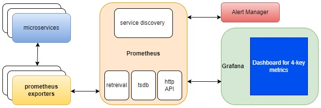

* This microservices throughput increases at some time of the year.

In case, when "some time of the year" means additional load in expected time period of the year:

There is a cronjob for Kubernetes can be realised (hpa_up.yml, hpa_down.yml).
The main action of it - ability to deploy additional pods with microservices in certain period of time and remove it when necessary (cron * * * )
Also, when "some time of the year" is the peak time, classical approach with multimetric scaling (multimetric_hpa.yml) can be realized.

* Create a flowchart to monitor 4-key metrics.

As one of the way to resolve it can be can be based on using Prometheus with its exporters, that collect necessary metrics (e.g. CPU, MEMORY, number of requests, availability, etc) and provide access to it for Prometheus server. Then data is passed to Grafana for visualization.
There is a common flowchart with reailization of it:

* Webhook can be realized with[test_webhook.yml](test_webhook.yml)

Please notice, ALL of these proposals can be optimized in case with detailed task.
